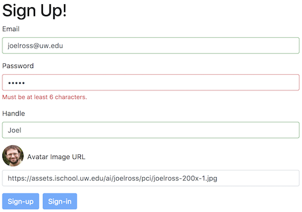

# Problem A

In this exercise, you will practice working with React component events and state, conditionally rendering elements, and using third-party components. Specifically, you will create a simple sign-up form (like you might find on a social media site) that perform _form validation_:



Much of this form is implemented for you; this will give you some practice reading and modifying existing React code.

## Running the Program
Because this app is created with React (and scaffolded through Create React App), you will need to install dependencies and run a developer web server in order to transpile and view the application. You can run this server by using the command:

```bash
# from inside the `problem-a/` folder
cd path/to/problem-a

# install dependencies
npm install  # only once per problem

# run the server
npm start
```

You can then view the rendered page _in a web browser_. Remember to check the Developer console for any errors!


## Exercise Instructions
To complete the exercise, edit the included **`src/SignUp.js`** and **`src/index.js`** files and add in the required code. Note that you should ___not___ need to edit any of the other provided files (including `index.html`).

1. When you first load the web page, you'll notice that it doesn't have any styling. You can start adding some styling using Bootstrap. While it is possible to load it from a CDN in the `index.html` file, it's better practice to `import` the library in the JavaScript, allowing `webpack` to bundle into into a single CSS file.

    First, use `npm` to install the latest version of Bootstrap:

    ```bash
    cd path/to/problem-a  #make sure you are in the correct folder
    npm install --save bootstrap@4.0.0-beta.2
    ```

    - Notice we use the `@` symbol to specify the version&mdash;otherwise you'd just get Bootstrap 3!

    Next, import the `boostrap.css` file into the `src/index.js` script (you usually do this after the React imports, but before you import `App` (in case the App comes with its own CSS styling)!

    ```js
    import 'bootstrap/dist/css/bootstrap.css';
    ```

    Once you have done this, you should see some basic styling (e.g., a `container`) be applied to the page!

2. If you were developing this app, the next thing you would do is start applying Bootstrap utility classes to the form to make it look nicer: things like `form-group`, `form-control`, `btn`, etc. 

    But as an alternative approach to having to write out a bunch of `className` attributes, you can utilize a set of **pre-built components** to easily declare "Bootstrap-style" forms, inputs, and buttons. On such set of components are available from the [**reactstrap**](https://reactstrap.github.io/) package.

    - Start by using `npm` to install the `reactstrap@next` package, as detailed on the [homepage](https://reactstrap.github.io/). Note that your app already includes `react` and `react-dom` so you don't need to re-install those.

    - In the `src/SignUp.js` file, add an `import` statement to import _named_ components `from 'reactstrap'`. In particular, you should start by importing `FormGroup`, `Label`, `Input`, and `Button`. Remember that you can import named components by listing them in `{}` brackets (e.g., `import { Component} from 'module'`).

3. Now you can begin using the `reactstrap` components instead of having to look up and add `className` attributes yourself. In the `render()` function of the `SignUpForm` component, make the following changes:

    - Each form field is currently contained in a `<div>`. Replace each of these divs with `<FormGroup>` elements. This will apply the `form-group` class automatically!

    - Replace each `<label>` with a `<Label>` element. This has the added benefit of making the `for` attribute into a prop, removing the warning about using `htmlFor` instead.

    - Replace each `<input>` with a `<Input>` element. This will apply the correct variable of the `form-control` class automatically, as well as support additional changes in the following steps.

    - Replace the `<button>` elements with `<Button>` elements. You can specify the style (e.g., `primary`) of the button with the [`color`](https://reactstrap.github.io/components/buttons/) prop. Both buttons should be "primary" buttons. 

    Now your form should look like it has proper styling!

4. The next step is to make sure that React can keep track of all of the form input (making them into [controlled components](https://reactjs.org/docs/forms.html#controlled-components)). To do this, add the following elements to the component's initial state: `email`, `password`, `handle` and `avatar`. All of these values should default to `undefined`. (Technically this means you don't need to initialize them, but it's good practice).

    Then add `onChange` event handlers to each `<Input>` element so that when the input is modified, the appropriate value in the Component's `state` is updated.

    - _Helpful tip:_ you can create a single `handleChange()` method that takes in an `event` (as normal). Then you can use the `event.target.name` property to determine _which_ input changed. By happenstance, the input `name` attributes correspond to the state properties, so you can do something like:

        ```js
        //specify which field to change in the stage
        let newState = {};
        newState[event.target.name] = event.target.value;
        ```

        Remember to call `setState()` to modify the state!

5. Clicking on the form buttons will cause the `signUpCallback()` and `signInCallback()` props to be executed. This props are passed in from the `SignUpApp` Component (at the bottom of the file). These callback functions will modify the App's `state`, specifying an `alert` message.

    Modify the `render()` function of the `SignUpApp` so that it displays an [Alert](https://reactstrap.github.io/components/alerts/) **instead of** the form when it has been submitted. To do this, you should use [conditional rendering](https://reactjs.org/docs/conditional-rendering.html) to first check if the `alert` is defined, and if so display it. Otherwise, show the `<SignUpForm>`

    - You will need to add `Alert` to the list of named imports from `reactstrap`. Color it as a "success" alert.

    - You can use an `if/else` block to decide what to `return`, an [element variable](https://reactjs.org/docs/conditional-rendering.html#element-variables), or an [inline if with a logical operator](https://reactjs.org/docs/conditional-rendering.html#inline-if-with-logical--operator); the last is a very slick approach.

    Note that you can "go back" to the unsubmitted form by reloading the page.

6. Finally, let's add in _form validation_. This will let the user know if they've provided bad input (before it gets sent to the server), and even keep them from submitting the form if it isn't filled in right!

    The `SignUpForm` component includes a `validate()` method that takes in two parameters: the value to validate, and an _object_ representing what properties that input needs to meet (e.g., a minimum length, valid email format, etc). The method returns an array of "error" messages if the value is invalid, or `undefined` if the value was undefined.

    In the `render()` function, use this method to determine whether or not the following values are valid:

    - The `email` input is `required` and should be in an `email` format.
    - The `password` input is `required` and should have a `minLength` of `6`.
    - The `handle` input is `required`.

    Assign the resulting "error arrays" to local variables (e.g., `emailErrors`).

    Additionally, create local variables e.g., `emailValid` that represent whether or not the field is currently valid. A field is valid if the "error array" are defined _and_ have a length of `0`. If the "error array" is undefined, this variable should be as well.

    You can temporarily log out these variables to test your work.

    _This is practice reading and working with existing code!_

7. Now that you've determined form validity, add some feedback for the user in three ways:

    1. Give each `<Input>` a `valid` prop that has a value of whether or not that input is valid. See the [reactstrap docs](https://reactstrap.github.io/components/form/) (scroll down to "Form Validation") for a somewhat-hard-to-read example. This will cause the input box to be highlighted green if valid or red if invalid.

        - As long as your `isValid` variables are `undefined` by default, the whole form won't start out red before the user has entered anything!

    2. Inside each `<FormGroup>` (after the `<Input>`), include an array of `<FormFeedback>` elements for each error message. You should _only_ show these if there are any error messages for that input (use _inline conditional rendering_), and can use the `map()` function to convert from the array of messages to an array of `<FormFeedback>` elements. These will automatically be styled and colored based on the validity of the `<Input>` in the group.

        - You will need to add `FormFeedback` to the list of components you `import` from `reactstrap`.

    3. Finally, give each `<Button>` a `disabled` attribute indicating whether the button should be disabled (e.g., `true` or `false`). The "Sign Up" button should only be _enabled_ if the `email`, `password`, and `handle` are all valid. The "Sign In" button should only be _enabled_ if the `email` and `password` are valid.

        - Think: "the button should be _disabled_ if it is _NOT_ the case that all the fields are valid".


## Testing
This exercise includes a test suite to verify that modified DOM is correct. Note that this test is simply to help you verify your results; it will not ensure that your code follows the required syntactical approach.

You can run the test suite using

```bash
# make sure you're in the root `exercise08` repo
cd path/to/exercise08

jest problemA
```

**Important** You will need to be in the repository's root folder for the tests to run!